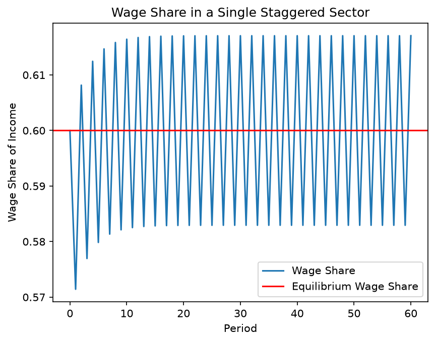
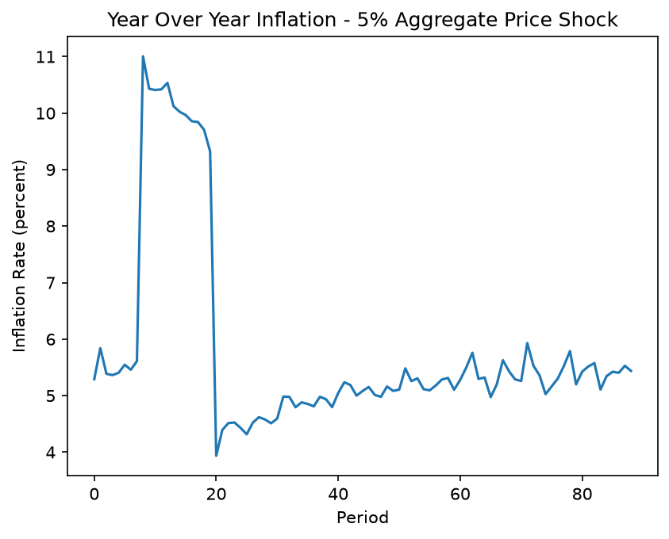
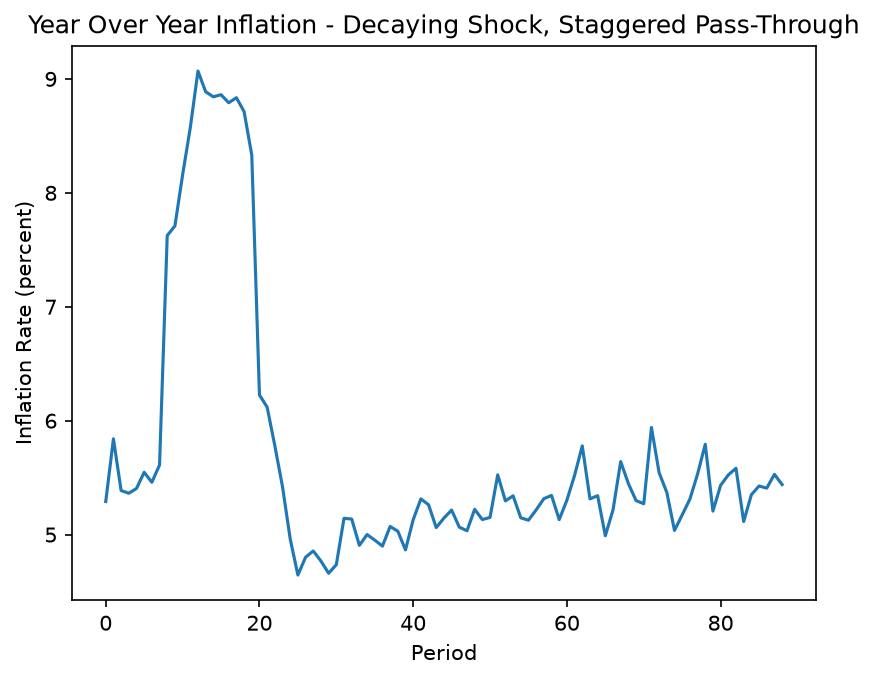
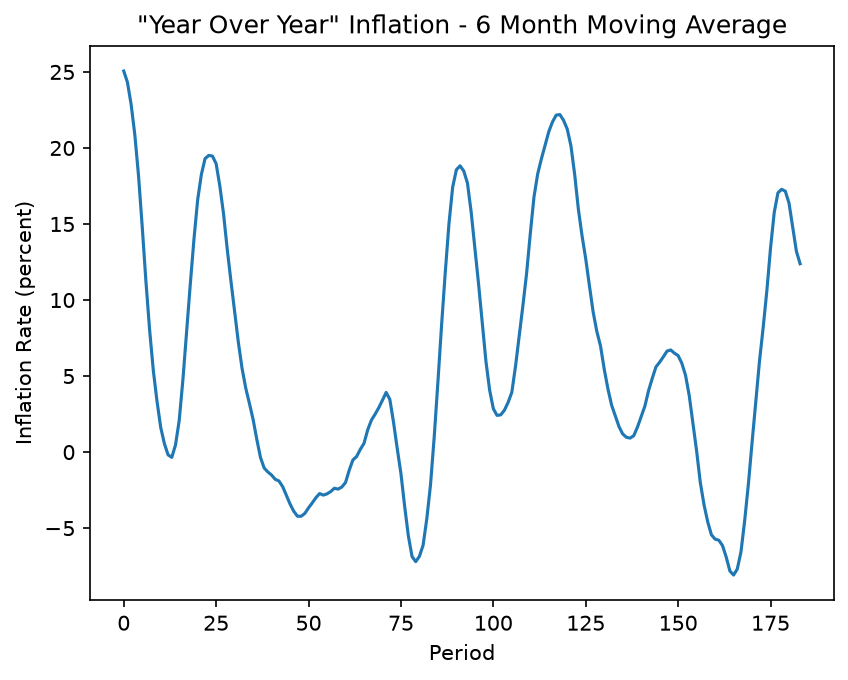
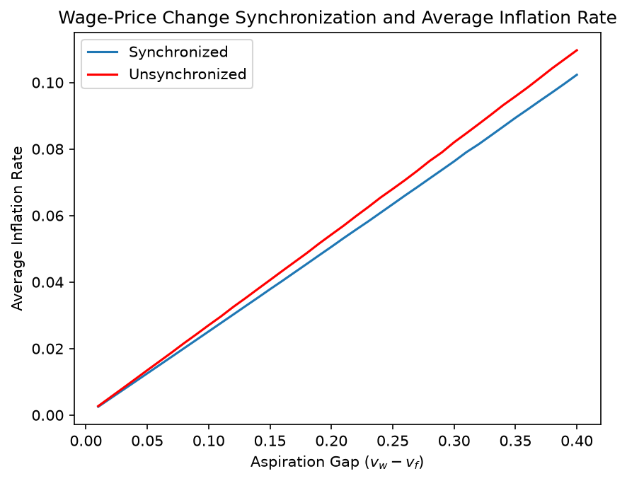

# Multi-Sectoral Inflation Model

This project is an implementation of a multi-sectoral inflation model in Python. The model extends the work of Professor Mark Setterfield (the New School for Social Research) to multiple sectors and introduces several dimensions of heterogeneity. In its current iteration, the model is meant to capture the dynamics of propagating exogenous price shocks in an economy in which sectors exhibit heterogeneity in the frequency with which wages and prices change.

## Core Concepts

The model is built around several core classes:

*   **`Economy`**: The main container for the simulation. It holds a collection of `Sector` objects and manages the overall simulation. It can advance the simulation by periods, calculate aggregate variables like the price index and inflation rate, and propagate exogenous price shocks.

*   **`Sector`**: Represents a single sector of the economy. Each sector has its own wage and price dynamics, which are determined by a set of parameters. These parameters control, among other aspects, the frequency and lag of wage and price adjustments, as well as bargaining power, pricing power, and productivity.

*   **`GlobalParams`** and **`SectorParams`**: These objects store the parameters for the model. `GlobalParams` are economy-wide parameters, such as the target wage shares for workers and firms. `SectorParams` are specific to each sector and include parameters like initial wages and prices, and the frequency of wage and price adjustments.

*   **`Settings`**: This class is used to configure a model run. It allows you to specify default parameter values, choose whether to generate parameters randomly, and set other constraints on the model.

## How to Run

The main entry point for running simulations is the `experiments.py` file. This file contains a number of functions that set up different economic scenarios, run the simulation, and graph the results.

To run an experiment, you can modify the `main()` function in `experiments.py` to call the desired experiment function. For example, to run a simulation with a single shock, you can call the `test_single_shocks()` function:

```python
def main():
    test_single_shocks(n_sectors=50, n_periods=100, shock_period=20, shock_size=0.05)

if __name__ == '__main__':
    main()
```

In this instance, this tests an economy with 50 sectors over 100 periods, simulating an aggregate price shock of 5\% to all sectors in period 20. Then, run the `experiments.py` file from your terminal:

```bash
python experiments.py
```

This will run the simulation and display a plot of the year-over-year inflation rate.

## Sample Output

The figures below are produced by the model.

### Wage share dynamics in a single sector

The basic mechanism of the model. Workers target a wage share of $v_w = 0.7$ and firms target $v_f = 0.5$; because neither can set wages and prices at the same moment, the realized wage share cycles around the equilibrium value implied by the two aspirations rather than settling on it. Here wages and prices each adjust every second period, with wages moving one period out of step with prices.



### An aggregate price shock

Fifty sectors with heterogeneous adjustment frequencies and lags, hit by a one-time 5\% price shock to every sector in period 20. Note that the horizontal axis indexes the year-over-year series, which begins 12 periods into the simulation: the shock enters the series at index 8 and drops out of it twelve periods later, at index 20. Inflation does not return to its pre-shock path, since the higher price level feeds back into wage and price setting.



### A decaying shock with staggered pass-through

The same heterogeneous economy, but the shock reaches a sector only in the periods when that sector's prices are due to change, and it decays geometrically at rate $\alpha = 0.6$. Because sectors absorb the shock at different times, the peak is lower and the rise more gradual than under the simultaneous shock above.



### Persistent stochastic shocks

An economy subject to an autocorrelated aggregate shock in every period, smoothed with a six-period moving average. Staggered adjustment turns serially correlated shocks into long, slow swings in the inflation rate.



### Synchronization and average inflation

Average inflation as a function of the aspiration gap $v_w - v_f$, comparing economies in which wage and price adjustment are synchronized within each sector against economies in which they are not. Inflation rises roughly linearly in the aspiration gap, and unsynchronized adjustment produces higher average inflation for any given gap. Each point averages 20 simulations of a 20-sector economy over 100 periods.



## Overview of Files

*   `economy.py`: Defines the `Economy` class, which manages the overall simulation.
*   `sectors.py`: Defines the `Sector` class, which models a single sector of the economy.
*   `params.py`: Defines the `GlobalParams` and `SectorParams` classes for storing model parameters.
*   `settings.py`: Defines the `Settings` class for configuring model runs.
*   `gen.py`: Contains the `Generator` class for creating `Economy` instances based on a `Settings` object.
*   `experiments.py`: The main script for running simulations and experiments.
*   `graphing.py`: Provides the `GraphingHelper` class for plotting simulation data.
*   `rw.py`: Contains functions for reading data from CSV files.
*   `test.py`: Contains test functions for verifying the model's behavior.

## Configuration

The model's behavior can be configured by modifying the `settings.py` and `params.py` files.

*   **`params.py`**: You can change the default values for global and sector parameters in this file. The `PARAMETER_INDICES` dictionary maps the columns of a CSV file to the corresponding sector parameters.

*   **`settings.py`**: This file allows for more flexible configuration of model runs. You can use the `Settings` class to:
    *   Set default values for all parameters.
    *   Specify whether to generate random values for certain parameters.
    *   Set constraints on the model, such as whether wage and price adjustment lags should match.

By creating and modifying `Settings` objects in `experiments.py`, you can easily run a wide variety of simulations.
